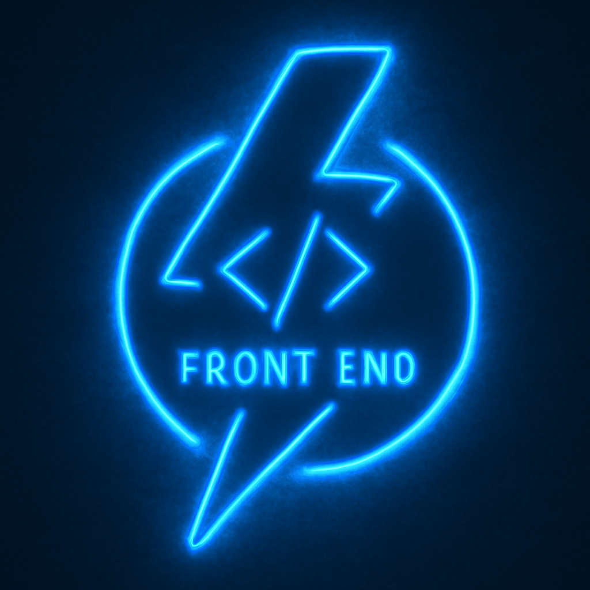

  

<h1 align="center">Hi, I'm Muhammad Amir</h1>
<h3 align="center">Junior Frontend Developer • React | Next.js | Vue | Tailwind CSS</h3>

---

### 👨‍💻 About Me

I'm a detail-oriented and passionate frontend developer from Kajang, Malaysia, with 3+ years of experience building real-world dashboards and user interfaces.

I’ve worked remotely with Singaporean startups and Malaysian tech companies to deliver intuitive, responsive, and scalable web applications. I specialize in React, Next.js, Tailwind CSS, and Vue.js. I value clean code, collaboration, and continuous learning.

I'm currently open to remote or hybrid opportunities — feel free to reach out!

---

### 📫 Contact

- 📧 **Email:** [muhamadev@outlook.com](mailto:muhamadev@outlook.com)  
- 🌐 **Portfolio:** [muhammad-portfolio-u6w9.vercel.app](https://muhammad-portfolio-u6w9.vercel.app)  
- 🐙 **GitHub:** [github.com/muhamadev0509](https://github.com/muhamadev0509)
